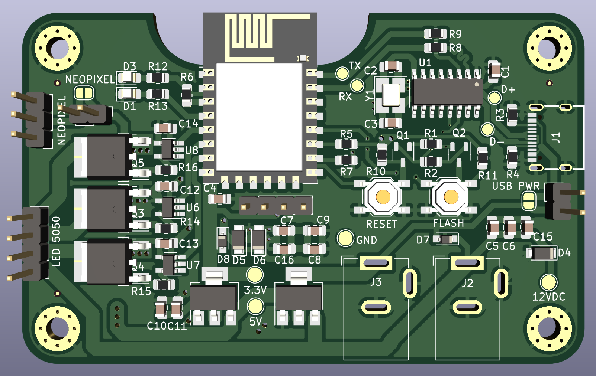
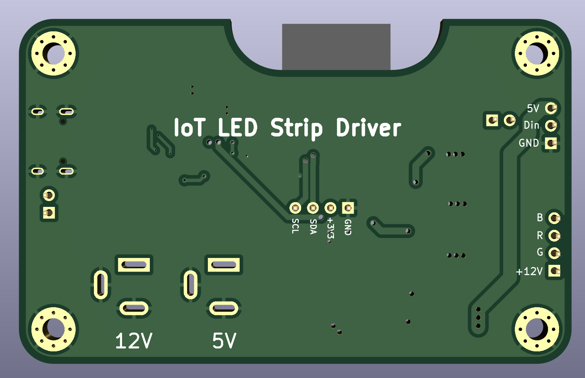
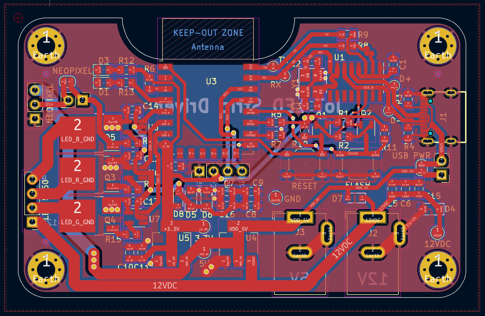

# IoT LED Strip Driver

An IoT enabled LED strip driver using ESP8266 capable of using both WS2812B (Neopixel) and standard 5050 12V LED strips. Goal is to integrate with the spotify API to allow color changes in reaction to music. 

## TODO 8/9
* [ ] Revise via sizes in design for compliance with JLC manufacturability requirements
* [ ] triple check schematic for correctness
* [ ] Verify trace thickness works for amount of current board can (theoretically) handle

### Features
* ESP8266 based for low-cost IoT Capability
    * Designed for assembly by JLC with low-cost components
* Capable of driving either 12V 5050 strips or individually addressable WS2812B (Neopixel) strips, changeable with only a pin jumper
* Programmable over USB C
* Included I2C Breakout, allowing addition of SSD1306 OLED if needed by user

## Notes and Usage
* Schematic can be found [here](output/iot_led_strip_pcb.pdf)
* To switch from 12V 5050 mode to 5V neopixels, either solder or use a pin header jumper to bridge the pads marked "NEOPIXEL"
* If board will only be used in 5V (neopixel) mode, then the 3 UMW30N06 Mosfets and 2 of the MCP1416 mosfet drivers are not needed. In either case, if the board will only be run in one mode then the unused 2.1mm jack does not need to be installed. 

### Photos

