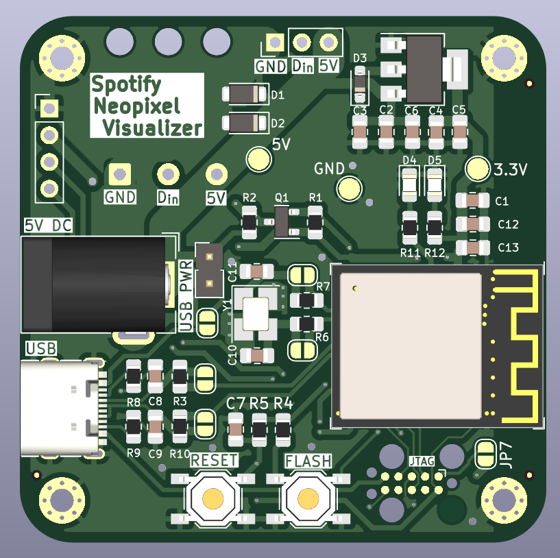
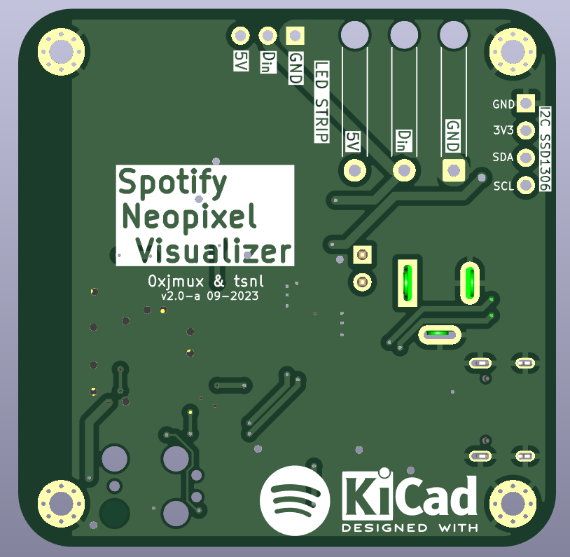
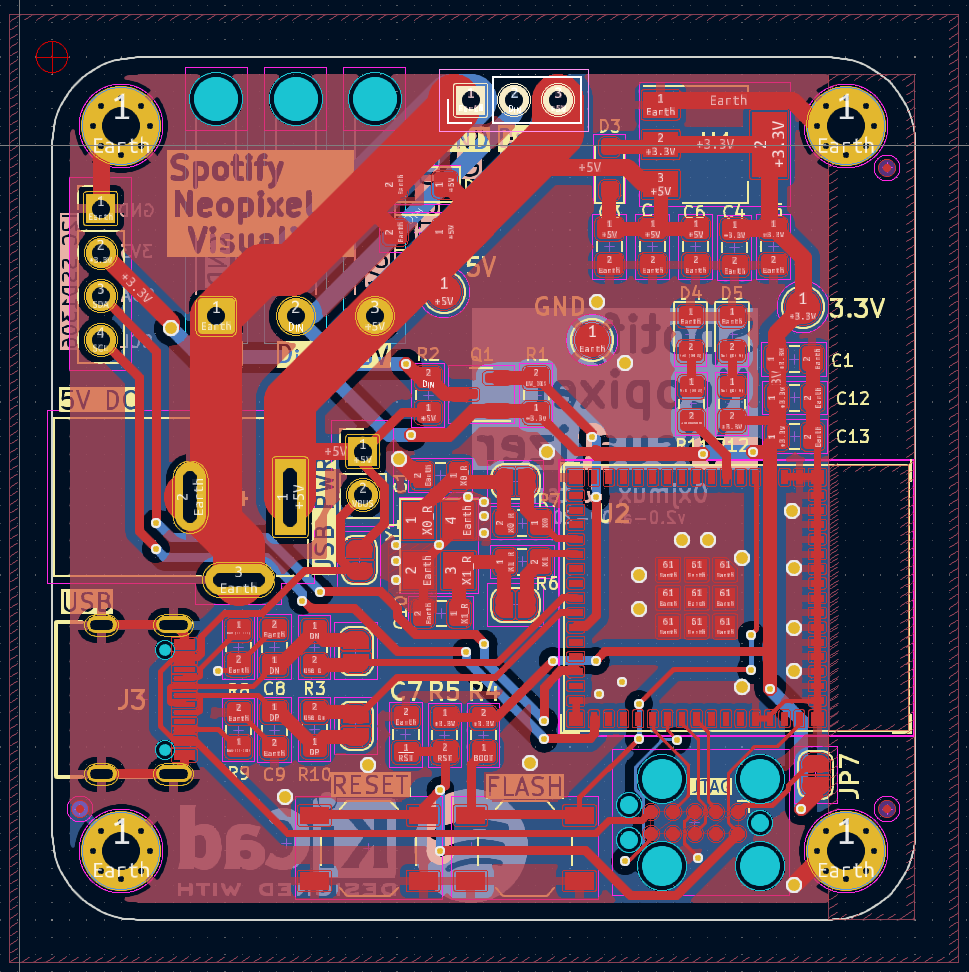

# Spotify Neopixel Visualizer
ESP32 WS2812B LED Strip Driver, using the spotify API to sync and pulse to music. Much more involved, ESP32 chosen because need for more capable hardware anticipated. 

## TODO 9/13
* [ ] triple check schematic for correctness
* [ ] Verify trace thickness works for amount of current board can (theoretically) handle

### Features
* ESP32 based for low-cost IoT Capability
    * Designed for assembly by JLC with low-cost components
* Programmable over USB C
* Included I2C Breakout, allowing addition of SSD1306 OLED if needed by user

## Notes and Usage
* Schematic(s) can be found [here](output/). 

> [!NOTE]
> Transfer docs in from obsidian once hardware is ordered!

## Photos
### V2 Prototype

### V1 Prototype
V1 never fully developed; right as the hardware was ready to be ordered the direction of the project shifted. 

#### V1 notes
* An IoT enabled LED strip driver using ESP8266 capable of using both WS2812B (Neopixel) and standard 5050 12V LED strips. Goal is to integrate with the spotify API to allow color changes in reaction to music. 
* If board will only be used in 5V (neopixel) mode, then the 3 UMW30N06 Mosfets and 2 of the MCP1416 mosfet drivers are not needed. In either case, if the board will only be run in one mode then the unused 2.1mm jack does not need to be installed. 
