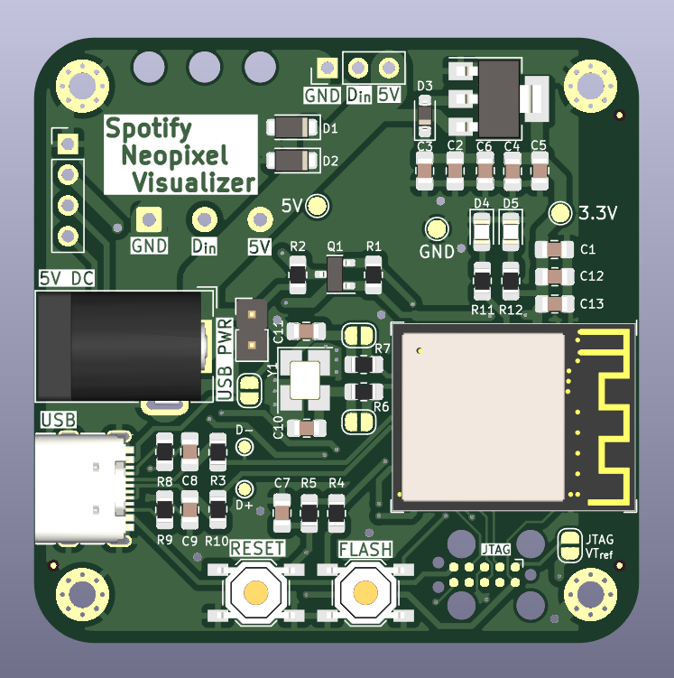

# Spotify Neopixel Visualizer
ESP32 WS2812B LED Strip Driver, using the spotify API to sync and pulse to music. Much more involved, ESP32 chosen because need for more capable hardware anticipated. 

### Features
* ESP32 based for low-cost IoT Capability
    * Board currently uses the `ESP32-S2-MINI-2-N4`
* Programmable over USB C
* Included I2C Breakout, allowing addition of SSD1306 OLED if needed by user
* Includes tag-connect JTAG header for full JTAG/SWD capability
* M2 mounting holes. 
* Designed for assembly by JLC with low-cost components
    * Entirely LCSC BOM, optimized for PCBA Assembly.

## Notes and Usage
* Schematic(s) can be found under [files/](./files/), and should be attached to major [releases!](https://github.com/0xjmux/iot_leddriver_hw/releases)
* See [Development information here!](DEVELOPMENT-NOTES.md)

## Photos
### V2.0 - ESP32 Based

### V1.0 Prototype
V1 was never fully developed; right as the hardware was ready to be ordered the direction of the project shifted. 

#### V1.0 notes
* V1.0 was an IoT enabled LED strip driver using ESP8266 capable of using both WS2812B (Neopixel) and standard 5050 12V LED strips. Goal is to integrate with the spotify API to allow color changes in reaction to music. 
* If board will only be used in 5V (neopixel) mode, then the 3 UMW30N06 Mosfets and 2 of the MCP1416 mosfet drivers are not needed. In either case, if the board will only be run in one mode then the unused 2.1mm jack does not need to be installed. 
