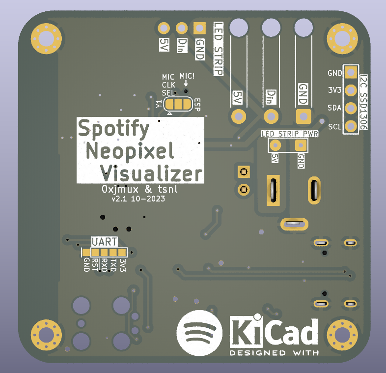

# Spotify Neopixel Visualizer Hardware
Simple and compact ESP32-based WS2812B LED Strip Driver.   

  

  

<!-- * Board firmware (in progress, not yet published) will be eventually available at [iot_leddriver_sw](https://github.com/0xjmux/iot_leddriver_sw). -->
* Origianlly planned to design my own firmware to integrate with the Spotify API Directly; but eventually switched to the much more featured combination of WLED + LEDFx. 
* Compatible with the popular [WLED](https://github.com/Aircoookie/WLED) firmware: just change the LED data pin to `GPIO21`. 
* (See [DEVELOPMENT-NOTES.md](DEVELOPMENT-NOTES.md) for full pinout and other information).

> [!WARNING]
> This was my first real PCB design, and I've improved a lot since I completed it. Take it (especially <=v2.2) with a grain of salt. 
 
### Features
* ESP32 based for low-cost IoT Capability, can use either `ESP32-S2-SOLO` (single core, cheaper) or `ESP32-S3-WROOM` (dual core). 
* Programmable over USB C, with Tag-Connect JTAG header for full debug capability. 
* Two ways to attach LED strip, either via pin header or with a strain relief. 
* Board designed to drive a 5m 60LED/m WS2812B strip with safety marign (see [DEVELOPMENT-NOTES.md](DEVELOPMENT-NOTES.md))
* Entirely LCSC BOM, designed for both hand and machine assembly. Able to be assembled by JLCPCB with low-cost components (almost all basic component BOM).

##### Optional Features and Mounting
* Designed to also be capable of driving 12V strips like the WS2811; only modification needed is changing the 5V overvoltage protection diodes (`D1`&`D2`, PN `SMF5V0A`) to 12V diodes (like `SMF12A`s)
* M2 mounting holes, various test pads, and an emergency UART header on the bottom. 
* Includes I2C breakout for optional addition of SSD1306 OLED.
* MEMS Microphone can optionally be added for live sound reactivity. 

#### Update 1/2024 - Now with a 3D Printable case!
* Check out [case/](./case/) for the 3D printable case I designed! This is the result of my first design using CAD in a very long time, and while it has some things I would change now I think it's still probably better published than not. 
* A PDF drawing of the case with dimensions can be found [here](case/iot_leddriver_drawing_v0.5.pdf).

## Notes and Usage
* Schematic, BOM, Gerbers, and all other files needed for production and assembly can be found attached to the latest [release!](https://github.com/0xjmux/iot_leddriver_hw/releases/latest)
  * This includes an interactive HTML BOM, which makes hand assembly much easier. 
* View current layout and schematic live on [KiCanvas](https://kicanvas.org/?github=https%3A%2F%2Fgithub.com%2F0xjmux%2Fiot_leddriver_hw%2Ftree%2Fmain%2FPCB)

  
 v2.1 showing LED strip standard JST connector connected to 5M WS2812B strip

## Versions
### V2.2 - QoL and Improvements for Production
* Mostly minor updates, to bring the board up to a more "production" ready state. Some modifications/fixes for small things found during manual assembly. 
* Power trace width from USB C port increased so short lengths of strip can be driven directly from USB.
* Traces cleaned up, PWR_LED can now be disconnected (if it's going to be deployed somewhere and the constant light is unwanted). USB_PWR jumpers removed. 
* BOM consolidation, some notes added to schematic, documentation improvements. 

### V2.1 - Hand Assembleable
* MCU originally selected for V2, the `ESP32-S2-MINI`, wasn't hand assemble-able; so it's been replaced with an `ESP32-S2-SOLO`. 
* Various small upgrades, including removal of non-necessary RC components, a mini UART header, and additional 5V power lines right next to the 2.1mm jack for strips with additional power wires. 
* The footprint and supporting components for a MEMS Microphone (`SPH0641LM4H-1`) added in case live sound reactivity is desired later on. 

### V2.0 - Complete redesign, now ESP32 Based
* Board upgraded to the `ESP32-S2-MINI-2-N4` for better compute capability, completely redesigned solely around the WS2812B.
* Most of the features listed above were introduced in this version.

---
### V1.0 Prototype
* [Link to v1.0 branch](https://github.com/0xjmux/iot_leddriver_hw/tree/v1.0)
* V1.0 was an IoT enabled LED strip driver using ESP8266 capable of using both WS2812B (Neopixel) and standard 5050 12V LED strips. Goal is to integrate with the spotify API to allow color changes in reaction to music. 
* V1 was never fully tested; right as v1.0 was ready my goal with the project shifted, and the ESP82666 just doesn't have enough compute for what I wanted to do. 
* If board will only be used in 5V (neopixel) mode, then the 3 `UMW30N06` Mosfets and 2 of the `MCP1416` mosfet drivers are not needed. Additionally, if the board will only be run in one mode then the unused 2.1mm jack does not need to be installed. 

