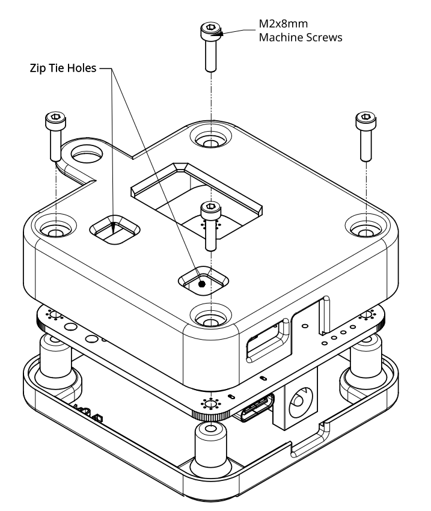
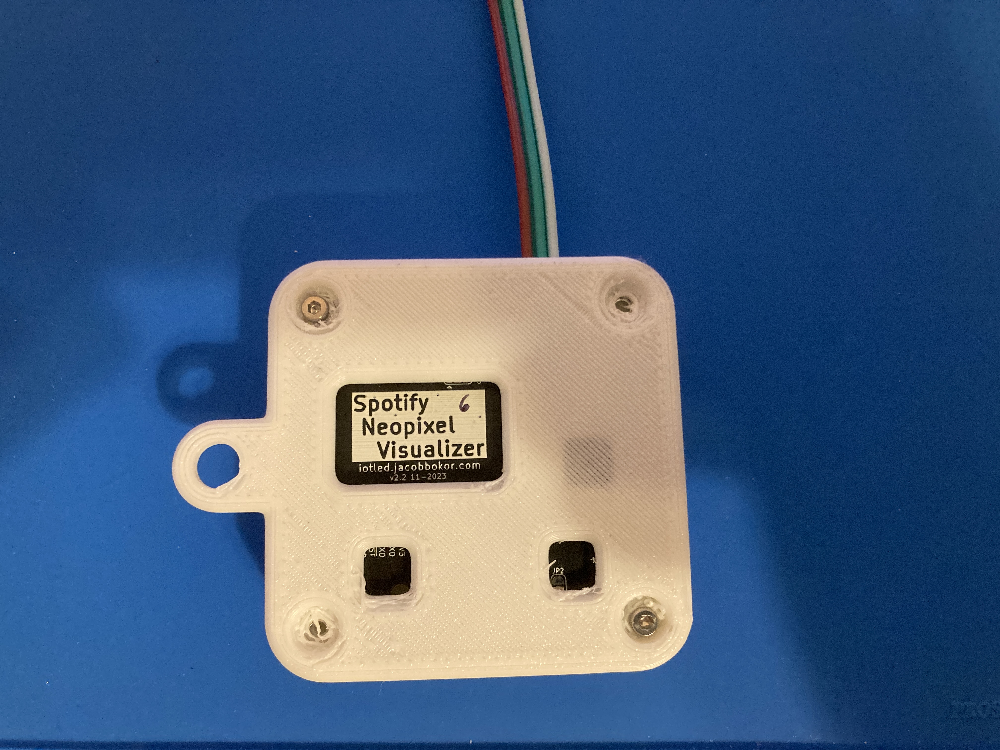

### Case info
* It's designed to be printed in PLA with 10% infill, and is held together by M2x8mm bolts. 
* The bolts are self tapping, and while I was originally planning on heat-set the self-tapped threads work so well that I'm just going to leave them as-is. 
* I included two different bottom models: One has a screwtab for easy mounting, and the other doesn't. You only need one. 

  
  
  

